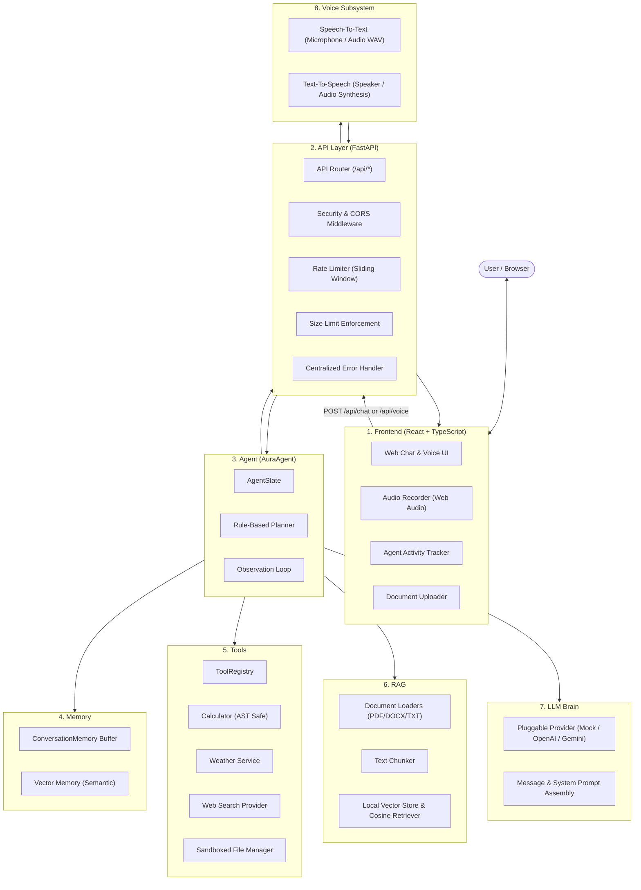

# AURA Architecture Report

This document outlines the final end-to-end architecture of **AURA** (AI Unified Response Assistant) across all subsystems:

```text
Frontend → API → Agent → Memory / Tools / RAG / LLM → Response → Voice
```

---

## 1. Architectural Overview & Component Pipeline

The AURA runtime executes a decoupled, modular pipeline coordinating client interaction, security controls, cognitive planning, contextual memory, tool execution, knowledge grounding, and speech synthesis:



---

## 2. Component Responsibilities

### 1. Frontend (`frontend/`)
- **Technology**: React 18, TypeScript, Tailwind CSS, Vite, Lucide Icons.
- **Responsibilities**:
  - Delivers a responsive, accessible chat interface with inline audio capture and playback.
  - Interacts exclusively with the backend via `VITE_API_URL` (configurable per deployment).
  - Displays safe, high-level **Agent Activity** (e.g. *Planning task*, *Using Calculator*, *Retrieving documents*, *Generating response*) without exposing chain-of-thought, tracebacks, or system prompts.
  - Provides fault-tolerant fallbacks for audio playback and displays user-friendly, sanitized errors.

### 2. API Layer (`app/api/`)
- **Technology**: FastAPI, Starlette, Pydantic, Uvicorn.
- **Clean ASGI Entrypoint**: `app/api/main.py` (aliased to `app.api.server:app`).
- **Responsibilities**:
  - **Endpoints**:
    - `GET /api/health`: Service readiness, status, and version.
    - `POST /api/chat`: Autonomous text chat cognitive cycle.
    - `POST /api/voice`: Full voice pipeline (Audio -> STT -> Agent -> TTS -> Audio Data URL).
    - `POST /api/documents/upload`: Document ingestion and RAG vector indexing.
    - `GET /api/documents`: List of indexed knowledge documents.
  - **Hardening & Security**:
    - Centralized rate limiting (sliding window algorithm with `Retry-After`).
    - Payload size limits (64 KB JSON, 10 MB audio/documents).
    - Production CORS enforcement (wildcard `*` explicitly prohibited in production).
    - Sensitive data masking in structured logs (API keys, tokens, base64 data).
    - Centralized error handling returning structured JSON without stack traces.

### 3. Agent Core (`app/agent/`)
- **Technology**: `AuraAgent`, `Planner`, `AgentState`.
- **Responsibilities**:
  - Implements the cognitive observation loop:
    $$\text{Goal} \longrightarrow \text{Plan} \longrightarrow \text{Action} \longrightarrow \text{Observation} \longrightarrow \text{LLM Synthesis}$$
  - Decomposes user goals into structured action steps (`calculator`, `retrieve`, `weather`, `search`, `files`, `respond`).
  - Tracks execution lifecycle (`IDLE`, `PLANNING`, `EXECUTING`, `COMPLETED`, `FAILED`).
  - Records safe user-facing activity logs while maintaining isolation from private planning internals.

### 4. Memory Subsystem (`app/memory/`)
- **Technology**: `ConversationMemory`, `VectorMemory`.
- **Responsibilities**:
  - Maintains conversation history across multi-turn sessions.
  - Stores user queries, assistant replies, tool calls, and tool results.
  - Injects relevant conversation context into prompt generation so the LLM can reference prior facts (e.g. user preferences or names).

### 5. Tools Subsystem (`app/tools/`)
- **Technology**: `ToolRegistry`, `CalculatorTool`, `WeatherTool`, `SearchTool`, `FileTool`.
- **Responsibilities**:
  - Encapsulates discrete capabilities behind a unified registry.
  - **Calculator**: Evaluates arithmetic expressions using Python AST traversal (`ast.parse`) with strict whitelists for operators and math functions. Prevents arbitrary code execution (`eval()` is strictly prohibited).
  - **File Manager**: Sandboxes read/write access strictly within controlled directories, enforcing path traversal defenses.
  - Returns structured results (`{"success": bool, "result": Any, "error": Optional[str]}`) back to the agent's observation loop.

### 6. RAG Subsystem (`app/rag/`)
- **Technology**: `LocalRetriever`, `LocalVectorStore`, `DocumentLoader` (PDF, DOCX, TXT).
- **Responsibilities**:
  - Ingests, parses, and splits uploaded reference documents into overlapping text chunks.
  - Embeds chunks using deterministic vector representations.
  - Performs cosine similarity search against user queries.
  - Supplies retrieved excerpts with source attribution metadata (`filename`, `page`, `chunk_id`) to the agent and LLM prompt.

### 7. LLM Brain (`app/brain/`)
- **Technology**: `LLMBrain`, `BaseLLMProvider` (`MockLLMProvider`, `OpenAIProvider`, `GeminiProvider`).
- **Responsibilities**:
  - Formulates system persona and prompt instructions via `build_llm_messages`.
  - Grounds final text responses on retrieved RAG chunks, observations, and tool results.
  - Supports offline zero-dependency operation via `MockLLMProvider` for deterministic testing and development.
  - Supports cloud LLM providers (OpenAI GPT-4o, Google Gemini) when configured in `.env`.

### 8. Voice Subsystem (`app/speech/`)
- **Technology**: `BaseSpeechToText` (`SpeechRecognitionSTT`, `MockSpeechToText`), `BaseTextToSpeech` (`Pyttsx3TTS`, `MockTextToSpeech`).
- **Responsibilities**:
  - **STT**: Converts incoming microphone or uploaded audio bytes (WAV, WebM, OGG) into transcribed query text.
  - **TTS**: Synthesizes agent textual responses into playable audio data URLs (`data:audio/wav;base64,...`).
  - **Fault Tolerance**: In the event of audio device or TTS provider failure, the textual response is guaranteed to reach the user while audio is omitted gracefully.

---

## 3. End-to-End Data Flow Scenarios

### Scenario A: Conversational Query
```text
User: "What is artificial intelligence?"
  → React sends POST /api/chat
  → FastAPI validates request & passes to AuraAgent
  → AuraAgent plans: [respond]
  → LLMBrain generates explanation
  → AuraAgent updates ConversationMemory
  → FastAPI returns ChatResponse with text & activities ("Planning task", "Generating response")
  → React displays response and safe activity status
```

### Scenario B: Tool Computation
```text
User: "Calculate 125 * 32 and explain the answer."
  → React sends POST /api/chat
  → AuraAgent plans: [calculator -> respond]
  → CalculatorTool evaluates AST (125 * 32 = 4000)
  → Observation recorded: "Calculated 125 * 32 = 4000."
  → LLMBrain synthesizes final response incorporating 4000
  → React renders answer: "125 * 32 equals 4000..." with "Using Calculator" activity
```

### Scenario C: RAG Document Question
```text
User uploads "AI_Notes.txt"
  → React sends POST /api/documents/upload
  → File verified, stored in documents/, indexed into vector store
User: "What does my document say about supervised learning?"
  → AuraAgent plans: [retrieve -> respond]
  → LocalRetriever searches vector store, retrieves relevant chunk
  → Observation recorded: "Retrieved 1 relevant document chunk(s)..."
  → LLMBrain grounds response using excerpt and includes citation: "Source: AI_Notes.txt"
  → React displays answer with "Retrieving documents" activity
```

### Scenario D: Voice Input & Output
```text
User speaks into microphone
  → React records audio/wav blob, sends POST /api/voice
  → STT transcribes speech to text
  → AuraAgent processes goal through observation loop
  → TTS synthesizes response text to audio bytes
  → FastAPI returns VoiceResponse with text, audio data URL, and activities
  → Browser plays audio and displays response text
```
